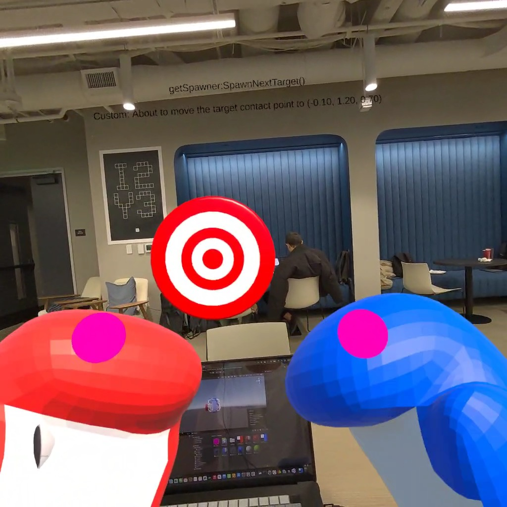
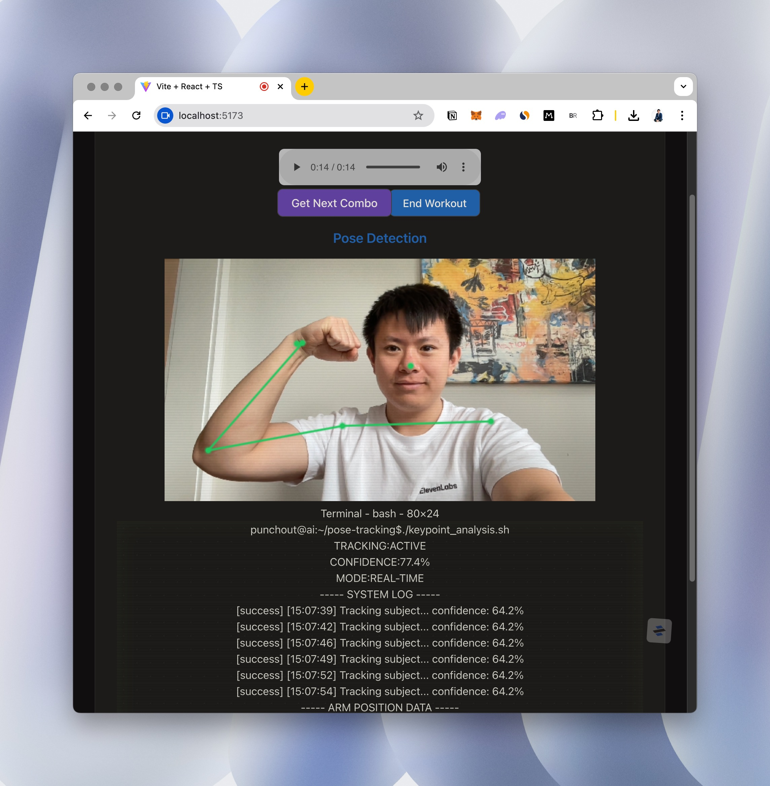

# Punch-Out!! AI




## 1. Motivation
Boxing training is expensive and often inaccessible. Personal training sessions can cost upwards of $100/hour, and even group classes are a significant expense. Recent advances in VR, AI, and computer vision now make it possible to deliver high-quality, personalized boxing instruction at a fraction of the cost. Punch-Out!! AI aims to democratize access to expert-level boxing training, allowing anyone to improve their skills safely and effectively, anytime, anywhere.

## 2. Project Overview
Punch-Out!! AI is a personal VR boxing coach that provides real-time guidance, motivation, and feedback. The system leverages a combination of technologies to create an immersive and effective training experience.
* **User:** The athlete seeking to improve their boxing skills.
* **Trainer:** An AI-powered avatar with a unique voice, providing instruction and encouragement.

## 3. Core Services
The system comprises three core services:
* **VR Engine (Meta Quest 3, Unity):** This is the core application. It renders the virtual training environment, handles game mechanics (punch detection, collision), and simulates the physics of movement. The VR Engine is built on the Meta Quest 3 platform using Unity.
* **Web Client (React, Eleven Labs):** A web-based interface used to initiate workouts. Critically, the web client handles the text-to-speech conversion of the trainer's script using Eleven Labs (`eleven_flash_v2_5`) and streams the generated audio using websockets.
* **Server (Python, Fast API, OpenAI LLM):** The backend logic hub. This service analyzes the athlete's performance (via computer vision data from the VR Engine), determines appropriate feedback using an OpenAI LLM (o3-mini), generates the trainer's script, and manages user progression.

## 4. Functional Requirements
* **Workout Initiation:** Users can start a new workout session through the web client.
* **Real-time Instruction:** The AI trainer provides verbal instructions, guiding the athlete through the workout. The AI Trainer has a unique voice persona.
* **Combination Training:** The initial release will focus on combination training, teaching users sequences of punches.
* **Form Analysis:** The system uses computer vision (within the VR Engine) to analyze the athlete's form during punches.
* **Adaptive Feedback:** The server generates qualitative feedback based on the athlete's performance (accuracy and form). This feedback is relayed to the user through the AI trainer's voice.
* **Progression:** The server tracks user performance (punch accuracy and form) and adjusts the workout difficulty accordingly.
* **Workout Summary:** At the end of a session, the user receives a summary of their performance.
* Audio Streaming: The web client must deliver the generated audio to the VR headset in real-time.

## 5. Technical Requirements
* **VR Platform:** Meta Quest 3
* **VR Development:** Unity
* **Frontend:** React, TypeScript
* **Backend:** Python
* **AI Voice:** ElevenLabs React SDK (`@11labs/react`), `eleven_flash_v2_5` model
* **LLM:** OpenAI (o3-mini)
* **Communication:** WebSockets for audio streaming

## 6. Key Performance Indicators (KPIs)
* **Weekly Sessions:** Average number of workout sessions per user per week.
* **User Retention:** Percentage of users who continue using the app over time.
* **User Reviews/Rating:** Average user rating and qualitative feedback from app store reviews.

## 7. Future Considerations
* Expanded workout types (e.g., basic punches, footwork drills, sparring).
* More detailed quantitative performance metrics.
* More diverse Trainer personalities.
* More tailored feedback on form from the pose tracking input.

## Setup

1. Clone the repository
```bash
git clone <repository-url>
cd punch-out-ai/client
```

2. Install dependencies
```bash
npm install
# or
yarn install
# or
pnpm install
```

3. Set up environment variables
- Create `.env.local` in the client directory
- Add your ElevenLabs API key and agent ID:
```
ELEVENLABS_API_KEY=your_api_key
NEXT_PUBLIC_AGENT_ID=your_agent_id
```

4. Run the development server
```bash
npm run dev
# or
yarn dev
# or
pnpm dev
```

The app will be available at http://localhost:3000

## Environment Variables

- `ELEVENLABS_API_KEY`: Your ElevenLabs API key
- `NEXT_PUBLIC_AGENT_ID`: Your ElevenLabs agent ID for the boxing trainer
